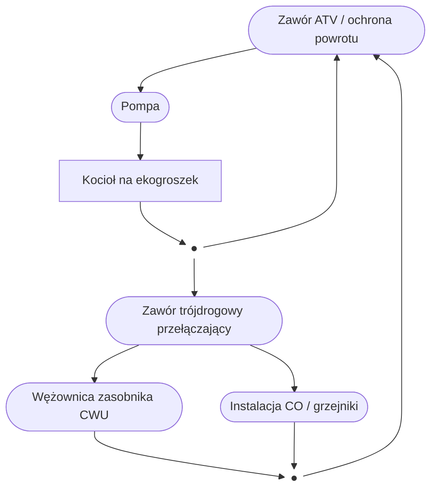

# Mała instalacja z jedną pompą 

```mermaid

flowchart TD

%% Kocioł 
ATV([Zawór ATV / ochrona powrotu]) --> P([Pompa]) --> K[Kocioł na ekogroszek] --> R1((●)) --> V3([Zawór trójdrogowy przełączający]) --> CWU([Wężownica zasobnika CWU]) --> R2((●))

R1 --> ATV


%% GAŁĄŹ CWU

%% GAŁĄŹ CO
V3 --> CO([Instalacja CO / grzejniki]) --> R2

R2 --> ATV

classDef wezly fill:transparent,stroke:transparent,stroke-width:1px;

class R1,R2 wezly
```

