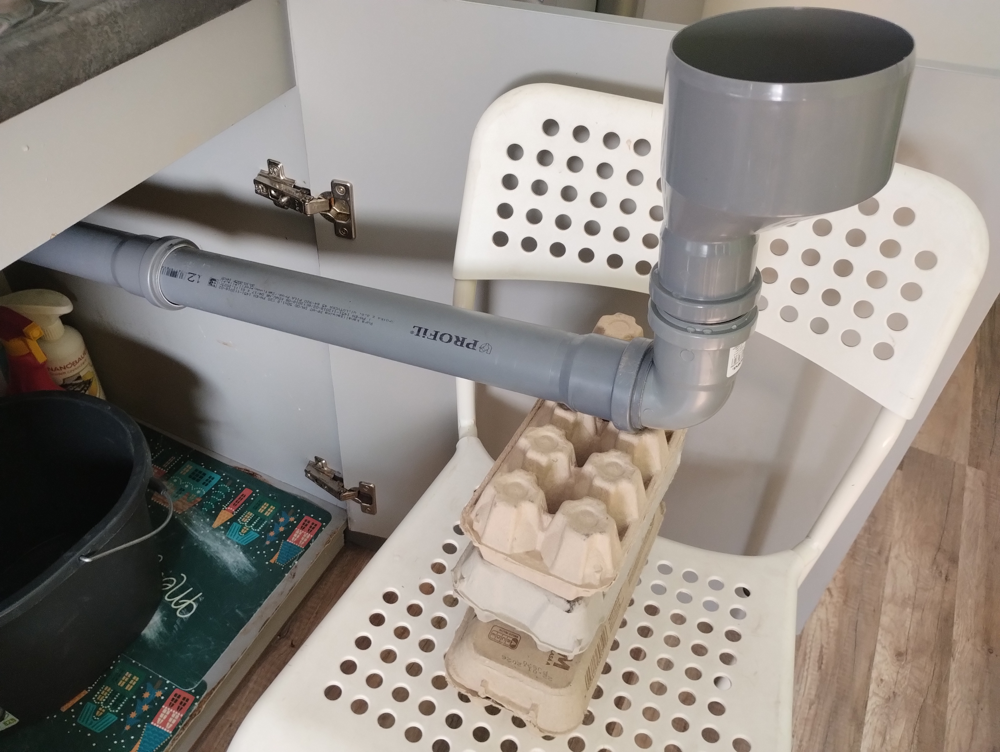
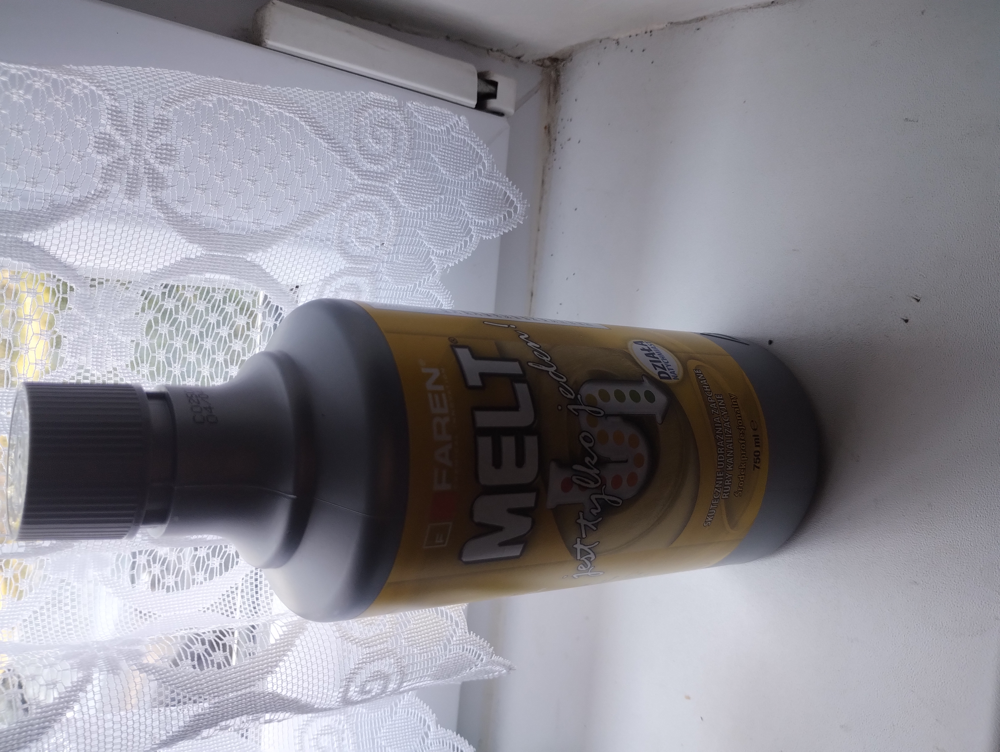
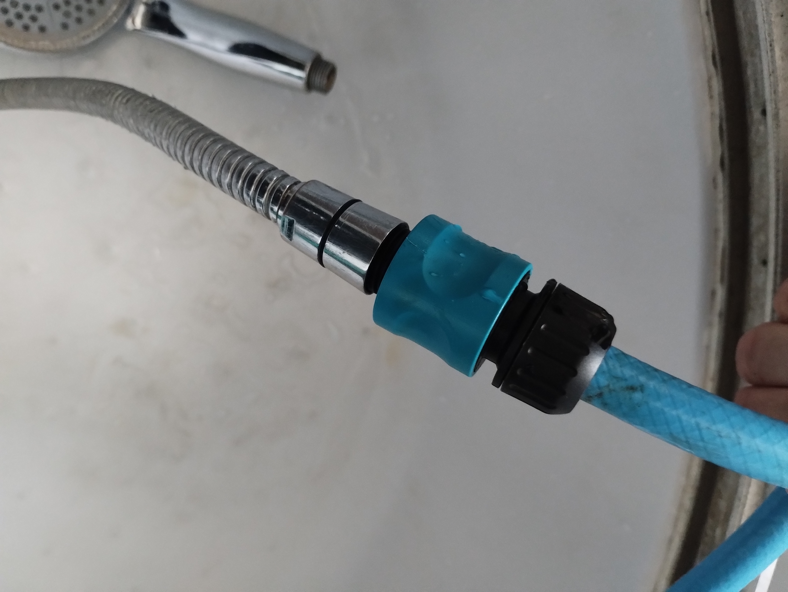
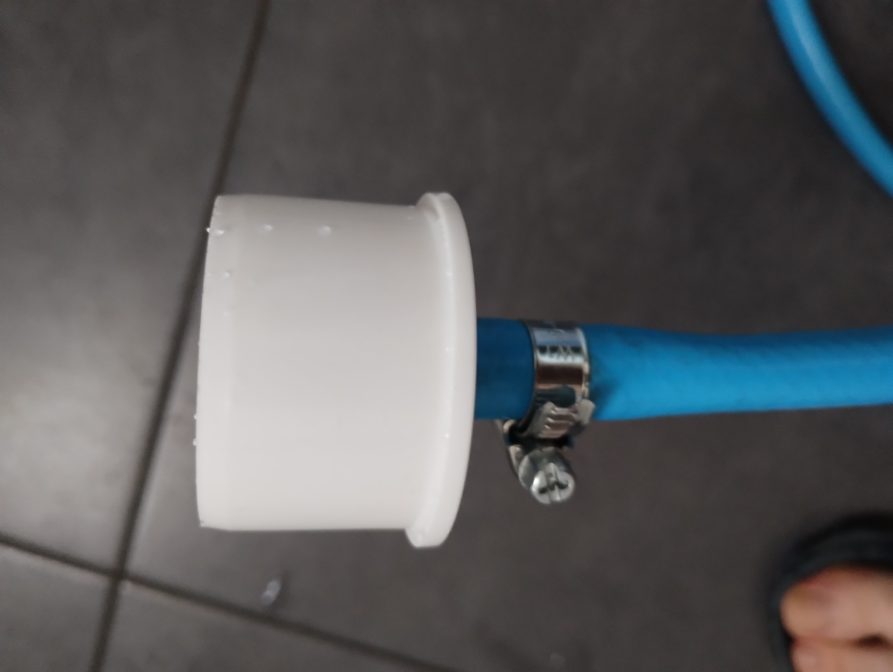
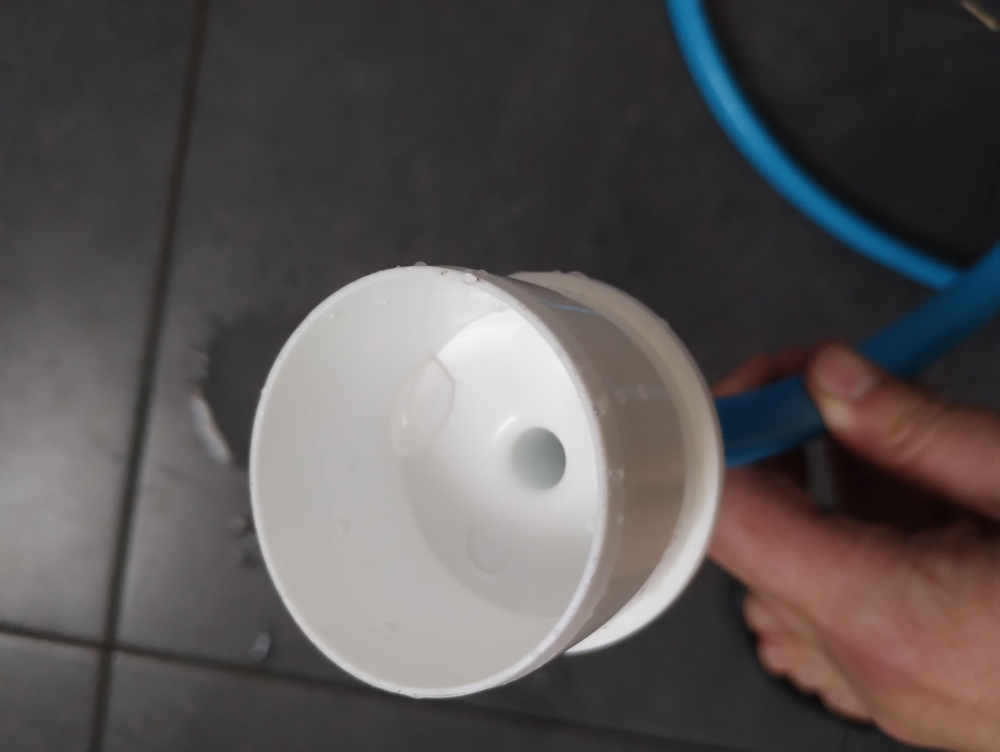

# Udrażnianie zlewu jak profesjonalista

Za pomocą "lejka"  

  

wlałem do odpływu zlewu kwas siarkowy.  

  

Do prysznica podłączyłem wąż.  

  

Na jego końcu umieściłem redukcję fi50.  

  .
  

Do przedłużki zamiast lejka podłączyłem redukcję, a następnie przytrzymując ją, żeby ciśnienie jej nie wypchnęło puszczono wężem wodę. Na początku ciśnienie próbowało wypchnąć redukcję, wkrótce jednak opór został pokonany i woda z kranu, jego maksymalnym strumieniem swobodnie odpływała do odpływu.